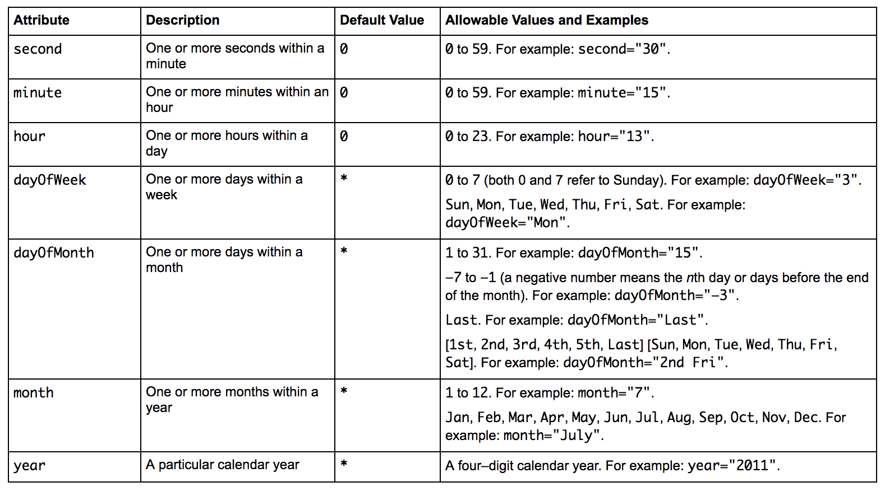

# Tópicos especiais

Neste material vamos apresentar os métodos de _Callback_, interceptadores e Recursos administrados.

## Métodos de _Callback_

Alguns eventos são desencadeados quando chamamos os seguintes métodos do `EntityManager`: `persist()`, `merge()`, `remove()` e `find()`, ou quando realizamos consultas. 

Para capturar estes eventos fazemos uso das anotações: `@PrePersist`, `@PostPersist`, `@PostLoad`, `@PreUpdate`, `@PostUpdate`, `@PreRemove`, `@PostRemove`.

A class `Aluno` exemplifica uma forma de capturarmos os eventos antes de salvar e após carregar a instância da entidade no banco de dados.

```
@Entity
public class Aluno implements Serializable {
    @Id @GeneratedValue
    private int id;
    private String nome;    
    @PrePersist // método executado antes de persistir
    public void antesDePersistir(){
        String value = String.format(
            "<aluno: %d, salvo em: %s>", 
            this.getId(), 
            LocalDateTime.now().toString()
        );
        System.out.println(value);
    }
    @PostLoad // método executado após o carregamento da entidade
    public void aposCarregar(){
        String value = String.format(
            "<aluno: %d, carregado em: %s>", 
            this.getId(), 
            LocalDateTime.now().toString()
        );
        System.out.println(value);
    }
}
```

Essa alternativa é interessante quando queremos capturar eventos e ter comportamento individual às entidades. Em um cenário onde podemos ter um mesmo comportamento aplicável às entidades podemos criar uma classe responsável por gerenciar a captura destes eventos. Para este fim, utilizaremos a anotação `@javax.persistence.EntityListeners`.

No código a seguir temos um exemplo de aplicação desta outra solucão.
```
@EntityListeners(LogEntities.class) // Precisamos adicionar à entidade
public class Aluno implements Serializable {...}

// Nesta classe é possível centralizar a captura dos eventos 
public class LogEntities {
    @PrePersist
    public void antesDeSalvar(Object entity) {
        String valor = String.format("<nome: %s e id: %d>", nome, id);
        System.out.println("antes de salvar: " + valor);
    }
}
```

## Interceptadores

A solucão apresentada anteriormente é aplicável às classes das entidades que representam o dominio da aplicação. Os interceptadores são objetos capazes de se interporem sobre chamadas de métodos ou eventos do ciclo de vida dos Session Beans e MDBs. Eles encapsulam o comportamento comum de vários beans, evitando poluição de código.

Podemos identificar os interceptadores quando temos classes java simples que possuem um método anotado com:
`@javax.interceptor.AroundInvoke`. 

Similar aos métodos de _Callback_, os interceptadores podem ser internos ou externos à classe. Nesse exemplo, temos um **interceptador interno**.

```
@Stateless
public class AlunoService {
    @AroundInvoke
    public Object interceptador(InvocationContext context) throws Exception {
        String name = context.getMethod().getName();
        System.out.println(
                String.format("A sequência do método:%s com parametros: %s", name,
                        Arrays.toString(context.getParameters())));
      return context.proceed();
    }
}
```

Para configurarmos um **interceptador externo** necessitamos criar uma nova classe (`Auditoria`) e na classe `AlunoService` utilizar a anotação `@javax.interceptor.Interceptors`.

```
@Interceptors({Auditoria.class})
public class AlunoService {..}

// Nova classe 
public class Auditoria {
    @AroundInvoke
    public Object interceptador(InvocationContext context) throws Exception {
        // Antes da execução do método (salvar, todosOsAlunos)
        String name = context.getMethod().getName();
        long inicio = System.currentTimeMillis();
        Object retorno = context.proceed();
        // Após a execução do método (salvar, todosOsAlunos)
        long fim = System.currentTimeMillis();
        System.out.println(
                String.format(
                    "Auditoria - O método:%s demorou: %d", 
                    name, (fim - inicio)
                )
        );
        return retorno;
    }
}
```

Em ambos os casos, os métodos recebem como parâmetro uma instância do tipo `InvocationContext` que é uma representação genérica do método que o cliente está invocando. Através dele é possível acessar informações do bean que está sendo invocado. O método `proceed()` deve ser chamado dentro do interceptador para que o método de negócio do bean seja, de fato, executado.  Além deste método, podemos chamar o método `context.getContextData()`, que nos permite atualizar ou recuperar informações associadas a excução de outros interceptadores.


## __Timer Service__

O __Timer Service__ é um serviço de execução de tarefa agendada, sendo recurso gerido pelo container EJB que fornece uma API de evento sincronizado. É utilizado para agendar timers (temporizadores) e fica associado a um Enterprise Java Bean. 

Podemos utilizá-los de duas formas: em eventos com um momento pré-definido ou eventos intervalares. 

```
@Stateless
public class AlunoService {
    @Schedule(hour = "*", minute = "*/1", second = "00")
    public void enviarEmailPorIntervalo() {
        System.out.println("enviando o email no intervalo... " + LocalDateTime.now());
    }
    @Schedule(hour = "11", minute = "11", second = "11")
    public void enviarEmailPorHorario() {
        System.out.println("enviando o email em um horário pré-definido... " + LocalDateTime.now());
    }
    @Resource
    private TimerService timerService;
    public void agendarEnvioDoRelatorioPara(Aluno aluno) {
        ScheduleExpression schedule = new ScheduleExpression()
                .dayOfMonth(1)
                .hour(12);
        // schedule.hour("*").minute("*").second("13,34,57");        
        TimerConfig timerConfig = new TimerConfig();
        timerConfig.setInfo(aluno);
        timerService.createCalendarTimer(schedule,timerConfig);
    }
    @Timeout
    public void enviarRelatorio(Timer timer) {
        System.out.println("enviando o relatorio em... " + LocalDateTime.now());
    }
}
```


## Recursos e JNDI

A JNDI (__Java Naming and Directory Interface__) é uma API para acesso a serviços de diretórios. Ela permite que aplicações cliente descubram e obtenham dados ou objetos através de um nome. Os recursos gerenciados pelo container EJB possuem seus nomes JNDI relativo ao contexto `java:comp/env`.

Com o EJB 3.1 tivemos o __Portable JNDI__ que permitiu o acesso com um nome portável entre os containers EJB. Antes disso, cada container gerenciava os nomes de forma individual. O __Portable JNDI__ segue o formato `java:[scope][/app-name]/module-name/bean-name[!fully-qualified-interface-name]`, por exemplo: `java:global/AppEar/AppEjb/CarrinhoDeCompra!org.job.dac.servicos.Carrinho`. Esse nome é definido no momento da implantação da aplicação, seja de forma explícita, seja de forma implícita.

Alguns outros exemplos de nomes portáveis:

* `java:global/banco/ContaSessionBean` 
* `java:global/banco/ContaSessionBean!org.exemplo.ContaSessionBean`
* `java:app/ContaSessionBean `
* `java:app/ContaSessionBean!org.exemplo.ContaSessionBean` 
* `java:module/ContaSessionBean `
* `java:module/ContaSessionBean!org.exemplo.ContaSessionBean`

O container gerencia alguns **Objeto administrados**, que são recursos configurados em tempo de implantação e  gerenciado pelo contêiner EJB em tempo de execução. Esses recursos podem ser acessados via `JNDI` através da classe `javax.naming.Context`.

```
@Stateless(name = "ejb/Repositorio")
public class Alunos{
    @PostConstruct // método executado após a criação da instância
    public void init() {
        try {
            Context c = new InitialContext();
            NamingEnumeration<NameClassPair> list = c.list(c.getNameInNamespace());
            while (list.hasMore()) {
                System.out.println(list.next());
            }
        } catch (NamingException ex) {
            Logger.getLogger(AlunoService.class.getName()).log(Level.SEVERE, null, ex);
        }
    }
}    
```
Quando utilizamos a arquitetura EJB podemos necessitar de instâncias de determinados recursos que são providos e gerenciados pelo container. Por exemplo, `javax.sql.DataSource`, `javax.jms.ConnectionFactory` ou `javax.mail.Session`, e nestes casos podemos fazer utilizar a anotação `@javax.annotation.Resource`.

```
@EJB(name = "ejb/Repositorio", beanInterface = Alunos.class)
@Stateless
public class AlunoService {
    private Alunos repositorio;
    @Resource 
    private SessionContext context;
    @Resource(name = "jdbc/__default") // java:comp/env/jdbc/sample
    private DataSource dataSource;
    @PostConstruct
    public void init() {
        repositorio = (Alunos) context.lookup("ejb/Repositorio");
        System.out.println("Datasource: " + dataSource);
        System.out.println("todosOsAlunos:" + repositorio.todosOsAlunos().size());  
    }
}
```

Neste exemplo, utilizamos a anotação `@Resource` para realizar a injeção de dependência de um objeto `DataSource` e `SessionContext`. O `DataSource` representa uma fábrica de conexões física com o banco de dados, sendo uma alternativa ao `DriverManager`. Já o `SessionContext` é uma interface que provê acesso em tempo de execução a intâncias de Session Beans. 

```
@Stateless(name = "ejb/Repositorio")
public class Alunos{
    @PersistenceContext
    private EntityManager em;
    public void salvar(Aluno aluno) {
        em.persist(aluno);
    }
    public List<Aluno> todosOsAlunos() {
        return em.createQuery("FROM Aluno a", Aluno.class).getResultList();
    }
}    
```